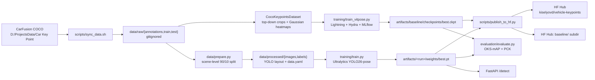

# Architecture

Two independent branches that share the same CarFusion COCO export but diverge at the dataset layer: YOLO consumes a processed YOLO-layout tree via `data.yaml`, while ViTPose reads the COCO JSON directly and renders Gaussian heatmaps per visible keypoint.

## Data flow

## Model-choice rationale

**Main — YOLO26-pose.** Ultralytics' YOLO26-pose is the natural main for this task: it is a single-shot detector that jointly regresses bounding boxes, objectness, and a configurable number of keypoints per instance. The `kpt_shape=[14, 3]` hyperparameter cleanly accommodates non-human keypoint classes without any architectural surgery. Throughput on an RTX 3080 is an order of magnitude higher than top-down alternatives (no explicit crop step), and the produced `.pt` checkpoint plugs straight into the Ultralytics inference CLI, ONNX exporter, and Hub publishing flow. These operational wins matter as much as the accuracy numbers.

**Baseline — ViTPose-S.** ViTPose is the academic reference implementation for transformer-based 2D pose estimation. Using the small variant (`ViTPose-S`, ~22 M params) pretrained on COCO human 17-keypoint gives us a concrete transfer-learning story: we replace the keypoint head with a fresh 14-channel deconv head and fine-tune. This provides a meaningful second number on the leaderboard and demonstrates that the repo is not locked into a single framework — the same evaluation protocol runs against both branches.

**Metrics — OKS-mAP + PCK.** Object Keypoint Similarity mAP is the COCO-standard metric for keypoint tasks: it accounts for per-keypoint sigmas (tolerance) and instance scale, which makes comparison against published baselines meaningful. We pair it with PCK@0.05 (Percentage of Correct Keypoints within 5% of the bounding-box diagonal), which is intuitive to read at a glance — "of all visible keypoints, how many did we get right?" — and is robust to the absence of validated per-keypoint sigmas for the car class.
