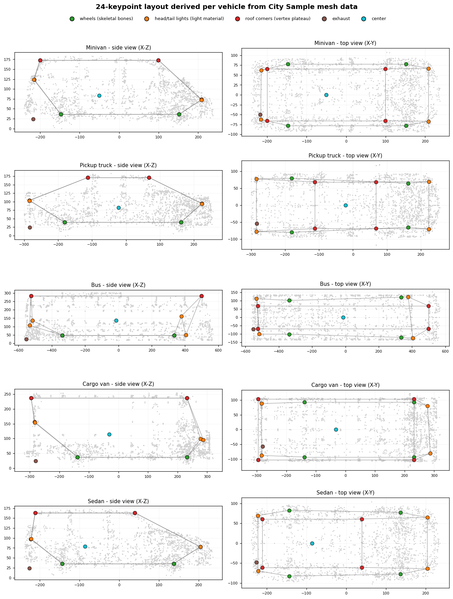
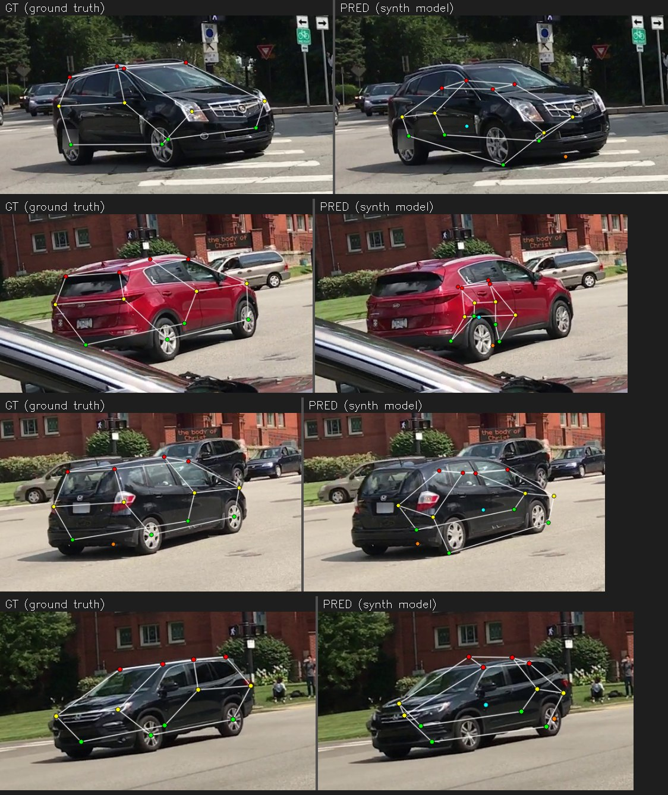

# Synthetic pre-training experiment (Phase 0)

Can synthetic data rendered in a game engine improve a real-world vehicle-keypoint
model? This page reports the experiment honestly - including a training bug the
investigation uncovered that turned out to matter far more than the synthetic data
itself.

The synthetic data comes from [**ue5-vehicle-synth**](https://github.com/kiselyovd/ue5-vehicle-synth): 2,510 frames rendered in Unreal Engine 5's City Sample across 4 venues x 3 lighting conditions x 3 hero vehicle rigs (sedan, minivan, pickup) plus randomized parked car/van types, with a 24-point keypoint schema (the first 14 match this repo's CarFusion canonical order). Dataset: [kiselyovd/citysample-vehicle-keypoints-24pt](https://huggingface.co/datasets/kiselyovd/citysample-vehicle-keypoints-24pt).

The kill switch: synthetic pre-training must lift OKS-mAP by **+2 pp** on the
held-out CarFusion test set (12,761 frames), or the approach is reconsidered.

## The headline finding: a flip-augmentation bug, not the synthetic data

Auditing the training pipeline revealed that **every** run - including the original
v1 baseline - used ultralytics' default `fliplr=0.5` with an **identity** keypoint
`flip_idx`. Horizontal-flip augmentation therefore mirrored the image **without
swapping left/right keypoints**: the "left wheel" label stayed on the left index
while the wheel moved to the right of the image, corrupting keypoints on ~half of
the augmented samples.

Fixing `flip_idx` to the correct left/right swap (`[1,0,3,2,5,4,7,6,8,10,9,12,11,13]`)
and re-running the **same** recipe (full CarFusion, 30 epochs) on the real data alone:

| Model | OKS-mAP | OKS-mAP@50 | PCK@0.05 |
|---|---|---|---|
| v1 baseline (identity flip_idx) | 0.2199 | 0.350 | 0.496 |
| **baseline, corrected flip_idx** | **0.5038** | **0.704** | **0.761** |
| **delta** | **+28.4 pp** | +35 pp | +27 pp |

One-line augmentation fix **more than doubled** the model's accuracy. This corrected
model is now the one published at
[kiselyovd/vehicle-keypoints](https://huggingface.co/kiselyovd/vehicle-keypoints).

## The kill switch, measured correctly

With the flip fix in place, the matched two-arm ablation was re-run fresh from **two** starting checkpoints - the weak v1 (0.220 OKS-mAP) and the strong production detector (0.504) - on the final mesh-derived 2,510-frame capture. Identical settings in both arms; the only difference is the synthetic data:

| Start | Arm | OKS-mAP | mAP50 | PCK@0.05 |
|---|---|---|---|---|
| weak (0.220) | control (100 real x8, no synth) | 0.381 | 0.625 | 0.666 |
| weak (0.220) | + synthetic | 0.364 | 0.625 | 0.619 |
| strong (0.504) | control (100 real x8, no synth) | 0.441 | 0.659 | 0.716 |
| strong (0.504) | + synthetic | 0.346 | 0.617 | 0.610 |

**Synthetic contribution: -1.7 pp OKS-mAP from the weak start, -9.5 pp from the strong one.** The supplement never helps, and it hurts more the stronger the baseline: a weak detector has accuracy to gain from any extra supervision, while a strong one only stands to lose from a large out-of-domain admixture. Capture difficulty matters too - on an earlier, easier capture the strong-baseline penalty was only -2.4 pp; the released capture is deliberately biased toward hard, occluded poses and triples it. The kill switch (**+2 pp or reconsider**) is decisively failed.

## Why the raw number is not the whole story

CarFusion is a **noisy yardstick**. Its ground truth is multi-view-triangulated and, even on its best-labelled cars, sparse and visibly scattered. Our synthetic labels are **pixel-exact by construction** (projected from the 3D mesh). But the noisy yardstick does NOT explain the penalty: recomputing the strong-baseline PCK penalty over only the 12 visually anchored points (dropping the unlabelable exhaust and center) leaves it unchanged at -10.6 pp, and per-keypoint the penalty is *mildest* exactly on those ill-defined points. The penalty is broad across well-anchored points - the signature of a domain shift, not label noise.

Two facts support that the synthetic **data** is high quality, independent of the
CarFusion comparison:

- A model trained **only** on the synthetic frames reaches **0.84 box mAP@50 / 0.60 pose mAP@50** on held-out synthetic frames - the 24-point labels are clean and learnable ([synthetic model on the Hub](https://huggingface.co/kiselyovd/citysample-vehicle-keypoints-24pt)). Notably, switching to the mesh-derived configs **doubled** in-domain pose mAP (0.33 -> 0.60): consistent labels are far easier to learn, even though real-image transfer stayed flat.
- The labels are mesh-exact by construction (above), denser (24 vs 14 points), and complete (no occlusion-triangulation gaps).

## Ruling out label geometry: the mesh-derived configs

One suspect for the transfer gap was the keypoint labels themselves. The original per-vehicle configs were a sedan template scaled by each vehicle's bounding box, which visibly mislocated points on non-sedan bodies - a van's roof and high tail lights, a pickup's cab-only roofline all got sedan-proportioned labels. The generator now derives every point from the vehicle's own mesh data: wheels from the skeletal wheel bones, roof corners from the body vertex cloud's roofline plateau, lights and mirrors from the centroids of the mesh sections bound to the light/mirror materials.

This gave a clean controlled test: re-capture, retrain synthetic-only, re-evaluate on real CarFusion. The answer is that **label geometry was not the bottleneck** - PCK@0.05 stayed at ~0.14 across the template-scaled, shape-corrected, and fully mesh-derived captures (0.144 / 0.134 / 0.142), even though the labels went from visibly wrong on large vehicles to geometrically exact. Per-keypoint results did shift the expected way (roof corners, whose geometry moved most, became the best-transferring points). The residual gap is appearance and coverage, not label precision.

What that looks like qualitatively - the synthetic-only model against real CarFusion ground truth (left GT, right prediction): the model has learned vehicle topology (roof/wheel structure), but localization on real photos is unreliable, worst on body shapes far from the small City Sample fleet.

## Honest conclusion

- The dominant real-world win was an **engineering fix** (correct flip augmentation, +28 pp), not the synthetic data. Rigor on the training loop mattered more than the data source.
- On the CarFusion-graded kill switch, the synthetic supplement **never helps and hurts more the stronger the baseline** (-1.7 pp weak, -9.5 pp strong). The kill switch is failed.
- **Label geometry is ruled out** as the cause: the mesh-derived control left synthetic-only transfer unchanged (~0.14 PCK), and the penalty is mildest on the ill-defined points. What remains is the appearance gap and, most acutely, **vehicle variety** - the City Sample fleet is ~a dozen models against the unbounded variety of real traffic.
- The synthetic dataset itself is demonstrably high quality (in-domain learnability + mesh-exact construction); its unique value is where real data cannot follow - exact 3D ground truth (see the 3D pose baseline in the paper) - not as a 2D supplement to a strong real detector.

## What's next

- A learned **monocular 3D / 6-DoF pose** model - the synthetic pipeline can emit
  exact per-keypoint 3D and object pose for free, which real datasets cannot. This is
  the use of synthetic data that real data genuinely cannot match.
- A cleaner real benchmark (or human-verified labels) to evaluate transfer without
  the CarFusion label-noise confound.

## Artifacts

- Updated real-world model: [kiselyovd/vehicle-keypoints](https://huggingface.co/kiselyovd/vehicle-keypoints) (OKS-mAP 0.50)
- Synthetic-only 24-pt model: [kiselyovd/citysample-vehicle-keypoints-24pt](https://huggingface.co/citysample-vehicle-keypoints-24pt)
- Synthetic dataset: [kiselyovd/citysample-vehicle-keypoints-24pt](https://huggingface.co/datasets/kiselyovd/citysample-vehicle-keypoints-24pt)
- Generator + pipeline: [github.com/kiselyovd/ue5-vehicle-synth](https://github.com/kiselyovd/ue5-vehicle-synth)
